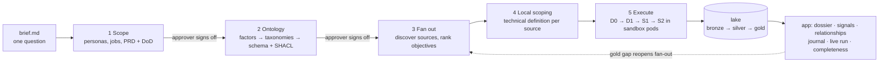

# Proveedor Abierto

**The reference case for [Ontofill](https://github.com/ricalanis/ontofill).** Ontofill is the engine: give it an
open question and it plans on Vultr models, dispatches disposable sandboxes, and returns a dataset where every value
has a receipt. It is generic by construction; a different brief gives a different PRD, ontology and sources with
zero code changes. Proveedor Abierto is its hard, real test case, and this repo holds that case package (`case/`)
and the investigation app that reads the engine's gold export.

**The question:** *"Who receives public money in Mexico through government contracts, and are they legitimate
companies?"*. There is no dataset and no list of sources. From that sentence, Ontofill researches the problem, writes
a PRD with a testable definition of done, and derives an ontology that a person approves. It then finds the public
sources on its own and sends sandboxed computer-use agents on Vultr to fill every field. Each value keeps its
capture: the source link, a screenshot and the selector. The app turns the result into dossiers, explained red
flags, relationships and a journal that traces any value back to the brief. Flags are signals to verify, never
accusations.

This is the track's own **"Research with Receipts"** example: every claim in the app links to a screenshot of its
source.

## Use case

**Who uses it.** Investigative journalists, civil-society watchdogs and auditors who need to check a company that
won public contracts, quickly and with evidence they can cite.

**What they do in the app.**
1. Open a **dossier** for a company (`/entities/<id>`). Every property shows its value, confidence and status.
2. Click a value's **capture**: the source link, the screenshot of the page and the selector the agent read.
3. Read a **signal** (red flag): the rule, the evidence, a plain-language explanation, how to verify it, and the
   dispute path for the company.
4. **Trace any value back to the brief** (`/journal/<value_id>`): capture step, technical definition, objective,
   ontology, PRD, brief.

**What the agent does to get there** (five phases, two of them approved by a person):



## Architecture: "Two instances. One boundary."

A control plane that plans on Vultr models and dispatches disposable sandboxes. The full, canonical description is
[`docs/planning/03-technical-architecture.md`](docs/planning/03-technical-architecture.md).

```
                 Judges / users ──HTTPS──▶ NetBird reverse proxy (PIN: investigator · SSO: approver)
                                                  │ WireGuard (zero open ports)
 ┌──────────── VX1 #1 · CONTROL PLANE ────────────▼─────────────────────────────────┐
 │ Proveedor Abierto app (reads gold export; dossier, run view, journal, approvals) │
 │ Ontofill engine: P1 scope → P2 ontology → P3 fan-out → P4 local scoping → P5 exec│
 │   ├─ decision interface ─▶ Inference gateway ─▶ Vultr Serverless Inference      │
 │   │                          (only real key · per-session tokens · Jev + safety) │
 │   ├─ Controller (MCP): sessions, cell pool, native loop / Skyvern backends       │
 │   ├─ Refiner: silver → SHACL → gold · metrics · DoD                             │
 │   └─ Postgres + Oxigraph (silver/gold graphs)                                    │
 └──────────────────────────┬───────────────────────────────────────────────────────┘
          CDP / cell API (control → sandbox only, NetBird + VPC)
 ┌──────────── VX1 #2 · SANDBOX HOST (zero secrets) ▼───────────────────────────────┐
 │ cell-1 [Skyvern brain? ─CDP─ gVisor Chromium hands ─ egress allowlist proxy]     │
 │ cell-N  … caps: mem/cpu/pids/timeout · destroyed after every session             │
 │ (optional: a throwaway VX1 per high-risk cell)                                   │
 └──────────────────────────┬───────────────────────────────────────────────────────┘
                            ▼
              Vultr Object Storage = bronze (raw captures, content-addressed)
```

- **Control plane (VX1 #1):** the engine plans each phase on Vultr models, this app reads the gold export and the
  live run feed, and the browser layer runs as three parts:
  - **Inference gateway:** an OpenAI-compatible proxy in front of Vultr Serverless Inference. It holds the **only
    real key**, issues a per-session token (time limit, dollar budget, revoked at close), attributes every model call
    to a session and step, and screens page content inside prompts with Jev and the Vultr content-safety model
    before forwarding. A flagged page is quarantined (wrapped as untrusted data), never silently passed on.
  - **Controller** (MCP): `session.open / act / observe / close`, a warm pool of cells, recycled after every session.
    Two backends: the **native** loop (primary, concurrent) and **Skyvern** for hard navigation (one unmodified
    Skyvern per cell, called over its API).
  - Postgres + Oxigraph for silver and gold, on the control VM (loopback only).
- **Sandbox host (VX1 #2), zero secrets:** each **cell** is gVisor Chromium "hands" behind an egress allowlist
  proxy, with memory, CPU, process and time caps, plus an optional Skyvern "brain" that holds only a session token.
  Each cell has its own network; it cannot reach the cloud metadata IP, the mesh or other cells. Live on the sandbox
  VM: a real cell reports runtime `runsc` and passes all six proof checkpoints (a local rehearsal without gVisor runs
  `runc`, and the proof panel says so).
- **Lake:** bronze (raw, content-addressed captures) on Vultr Object Storage; silver (observations with evidence,
  conflicts kept) and gold (reconciled, SHACL-valid values). Git never holds captured data. An ontology or PRD change
  re-refines gold from bronze without browsing again.

**Execution modes per step,** chosen by the technical definition for each source and escalated only when a check fails:

| Mode | What runs |
|---|---|
| D0 | download + parse (CSV, XLSX, PDF, API), no model |
| D1 | a crystallized script; the model only maps, parses or repairs fields |
| S1 | the native agent loop: observe → Jev gate → plan (Vultr tool call) → Jev action guard → act → Jev check → Vultr vision verify |
| S2 | Skyvern in its own cell, through the gateway |

**Two execution patterns, both visible in the Ontofill Console** (the engine's operator console, a separate product
at `https://ontofill-console.<domain>`; this app shows only the published result):

| Pattern | Loop | Where you see it |
|---|---|---|
| B, browser use (primary) | browser action → a Vultr vision model verifies the screenshot against the step goal → retry if not achieved. A person approves anything final through the **approve-before-submit gate**. | console run view: verify verdicts per action; console approvals: action requests with screenshot and risk tier |
| A, code execution | extractor code attempt → run in the sandbox against stored captures → stderr fed back → patch → retry; a passing extractor is promoted to a macro | console run view: repair attempts with result, stderr excerpt and diff |

Every sandbox job reports **six proof checks** on the console's run view → Sandbox proof: host check, task result, where it ran,
isolation probe (BLOCKED), teardown and secret hygiene (no keys in the pod; metadata IP and mesh BLOCKED). The
proof also shows each job's resource limits (memory, CPU, processes, timeout, steps) and any job a limit killed.

## Setup: run it yourself

Four pieces, in two repos. Commands below were checked against the code; env vars are names only (values live in
gitignored `.env` files on the machine that needs them).

**1. The product (this repo), synthetic data, no credentials**

```bash
uv sync --all-extras
uv run pa-app serve --fixtures                         # http://127.0.0.1:8400, synthetic export
uv run pa-app fixtures --domain libraries .cache/libs   # a second, unrelated domain: same screens, no code changes
uv run pa-app dod --gold-dir <export>                   # recompute the DoD from gold, cross-check metrics.json
uv run pytest -q                                       # unit, HTTP, schema and headless-browser tests
```

Against a real engine export: copy `lake.example.yaml` to `lake.yaml` (S3 or `kind: file`), or set `PA_GOLD_DIR`
to a local export; `PA_RUN_ID` (or `serve --run-id`) pins a run; `PA_CASE_DIR` points at the case package. The product
is consumer-only: approvals, the live run view, spend, evidence and replay live in the Ontofill Console.

**2. The engine** ([Ontofill](https://github.com/ricalanis/ontofill))

```bash
cd ../ontofill && uv sync
uv run ontofill run ../proveedor-abierto/case --to-phase 1 --budget-usd 2   # add --run-id run-<id> to name it
```

- Inference: in the deployment the engine calls Vultr **only through the inference gateway**:
  `VULTR_INFERENCE_BASE_URL=http://<control NetBird IP>:8700/v1` and, in `VULTR_INFERENCE_API_KEY`, the engine's
  gateway service token (not a Vultr key; see the browser-agent README, "Service principals"). On a development
  laptop without the gateway you can instead put a direct Vultr key there; then nothing screens the prompts.
- Lake: `lake.yaml` next to the case (`bronze.kind` s3 with `AWS_ACCESS_KEY_ID` / `AWS_SECRET_ACCESS_KEY`, or file).
- Checkpoints: a run stops with **exit code 3** at each human checkpoint (PRD, factors, ontology) and writes
  `APPROVAL_PENDING.md`. A person decides in the Ontofill Console (or, in development only, by writing `APPROVED` by
  hand); the next `ontofill run` resumes or, after a deny with a reason, regenerates the artifact.
- A second, unrelated brief (public libraries) runs in scratch with the same engine: see the Ontofill README,
  "Try a second brief through the ontology checkpoint".

**3. Inference gateway, controller and cells** (`ontofill/services/browser-agent`)

```bash
cd ../ontofill/services/browser-agent && uv sync
uv run ba-gateway                                   # 127.0.0.1:8700; the only process with VULTR_INFERENCE_API_KEY and JEV_API_KEY
uv run ba-controller --transport streamable-http   # MCP: session.open / act / observe / close
```

Gateway: `BA_GATEWAY_ADMIN_TOKEN`, `BA_GATEWAY_LOG`, `BA_GATEWAY_HOST` / `BA_GATEWAY_PORT`,
`BA_GATEWAY_SERVICE_TOKENS` (the engine's principal, by token hash and budget). Cells: `BA_CELL_PROVIDER=ontofill-http`
with `BA_CELLS_URL` / `BA_CELLS_TOKEN` drives the engine's gVisor substrate, served by `ontofill cells serve --port 8766`
(needs `ONTOFILL_CELLS_TOKEN`, and `ONTOFILL_SANDBOX_DOCKER_HOST=ssh://…` for the sandbox VM's Docker with `runsc`).
Live view per session: `BA_LIVEVIEW_EXPOSE=netbird` with `BA_LIVEVIEW_HOST=<control NetBird IP>` and
`BA_LIVEVIEW_PORTS`.

**4. The Ontofill Console** (`ontofill/console`)

```bash
cd ../ontofill/console && uv sync
uv run ontofill-console serve --fixtures .cache/console-fixtures --identity local   # two synthetic cases, dev mode
ONTOFILL_CONSOLE_CASES="main=/path/to/case" uv run ontofill-console serve        # real cases, SSO identity
uv run ontofill-console replay /path/to/local/lake --scratch /tmp/replay           # demo insurance, scratch copy
```

Behind NetBird SSO the approver's identity comes from the header named in `ONTOFILL_CONSOLE_IDENTITY_HEADER`
(default `X-NetBird-User`); `/whoami` shows which headers arrive (names only). Every decision is bound to the
artifact's sha256 and appended to the case's `decisions.jsonl`.

**Deploy** ([`deploy/README.md`](deploy/README.md)): two Vultr VMs joined by NetBird. The control VM runs the product
container (`deploy/compose.yaml`, bound to its NetBird IP), the console (`ontofill/console/deploy/compose.yaml`), the
gateway, controller and cell API; the sandbox VM runs Docker with gVisor `runsc`. `deploy/netbird_services.py
plan|apply|status|retire` manages the two public services; `deploy/verify.sh remote <vm-ip> <product-url>
<console-url>` proves zero open ports and that both URLs refuse unauthenticated requests.

**Public URLs:** the product at https://proveedor.eu1.netbird.services (password) and the Ontofill Console at
https://ontofill-console.eu1.netbird.services (NetBird SSO, approvers group). The product currently serves the
**synthetic** fixture export: the real case is paused at its PRD checkpoint and has no gold yet.

**Generic over the ontology.** The app takes its domain from the case's approved ontology: the primary class,
property labels, definition-of-done properties, relations, rules and source classes
([`app/README.md`](app/README.md)). `pa-app fixtures --domain libraries` builds a public-libraries case that renders
every screen with no code changes.

| Folder | What goes there |
|--------|-----------------|
| `case/` | The case package: brief (the only human input), PRD, ontology, objectives, technical definition documents, macros. Written by the engine, forkable. |
| `app/` | The consumer product: dossiers with receipts, explained signals, relationships, case journal, watchlist, open exports, completeness |
| `deploy/` | Product container, NetBird services, remote verification |
| `lake.example.yaml` | Pointer to the external lake (copy to `lake.yaml`; secrets only in env vars) |
| `docs/` | Definition docs, the demo script and the NetBird evidence images (`docs/evidence/`) |

Code: Apache-2.0 (`LICENSE`). Case package: CC BY 4.0 (`case/LICENSE`). No data in git. Public sources only, no logins.

## The app

Investigation, not a dashboard. Every screen reads the engine's gold export and nothing else, and takes its
vocabulary from the case ontology.

- **Dossier** (`/entities/<id>`): every property with its value, confidence, status (gold, conflict,
  missing) and captures. Click a value's captures to see the source link, the screenshot and the selector the
  agent read.
- **Signal explainer** (`/signals`): each red flag with its rule, the evidence it was computed from, a
  plain-language explanation, steps to verify it, and a dispute path. Signals are prompts to check, not accusations.
- **Relationships** (`/relationships`): entities linked by the relations the ontology defines (here: shared
  address, shared legal representative, same procedure), each link backed by the value that creates it.
- **Case journal** (`/journal/<value_id>`): a replay from any value back to the brief, through the capture
  step, the technical definition, the objective, the ontology and the PRD.
- **Watchlist and open export** (`/watchlist`, `/export/*`): follow entities and see what changed since the
  previous run. Export gold as CSV or RDF Turtle, and as OCDS 1.1 JSON when the ontology aligns a class to OCDS.
- **Completeness** (`/completeness`): the definition of done recomputed from gold and cross-checked against the
  engine's own `metrics.json`, including each declarative DoD query. It shows per-property bars and taxonomy
  coverage per level, and can follow a run live.

Operator and approver work is not in this app: the live run view, approvals (PRD, factors, ontology and
approve-before-submit actions), spend, evidence and replay are the **Ontofill Console**'s (`ontofill/console`,
CONTRACT §14), behind its own SSO-gated URL.

`uv run pa-app dod` recomputes the definition of done from gold and cross-checks `metrics.json`.

Fixtures are synthetic and obviously fake: "Proveedor Ejemplo NN", RFC-shaped IDs starting with `ZZZ`, and
hosts on the reserved `.example` domain. They validate against the engine's contract JSON Schemas.

## Access: two products, two gated URLs

Two services are public, each behind NetBird's reverse proxy with its own access policy. Neither VM opens an
inbound port.

| URL | What it is | Can | NetBird access policy |
|-----|------------|-----|-----------------------|
| `https://proveedor.<domain>` | this app, the consumer product | Read one case's published gold export and export it. Server side is read-only; the watchlist lives in the browser. | shared password (or PIN) |
| `https://ontofill-console.<domain>` | the Ontofill Console (engine repo) | Cases, runs and live view, approvals, spend, evidence, replay. Each decision takes its approver from the SSO identity header, is bound to the digest of the exact artifact reviewed (409 if it changed), and is appended to `decisions.jsonl`. | SSO restricted to the approvers group |

The product has no write routes at all (approval, run and spend routes return 404) and runs in a container with the
case mounted read-only.

### NetBird: the Zero-Port Access bonus

How it is deployed and gated: [`deploy/README.md`](deploy/README.md). Management is NetBird Cloud.

| Bonus criterion (NetBird deck) | Our setup | Evidence |
|---|---|---|
| 1. No open ports | The containers bind to the VM's NetBird IP, not a public interface. The public URLs go through the NetBird reverse proxy. The VMs allow zero public inbound ports, SSH included (admin over NetBird). | `deploy/verify.sh remote` ✓ (all checked ports closed, port 22 included) · `verify.sh local` ✓ |
| 2. Gated access tied to a role | Two URLs, two credentials: the product = password or PIN; the Ontofill Console = SSO restricted to the approvers group, and each approval records the SSO identity. The product has no approval routes at all (404) and a read-only container. | `verify.sh remote` ✓ (both URLs refuse unauthenticated requests) · [services and their auth](docs/evidence/netbird-services.png) ✓ |
| 3. Peer-to-peer | The control-plane VM and the sandbox VM talk over WireGuard; the sandbox host sits in its own group, which can reach only the control plane's ports (the deck's "fence in your agents"). | [VM peers and groups](docs/evidence/netbird-peers-groups.png) ✓ · [access policies](docs/evidence/netbird-policies.png) ✓ (sandbox → control plane: tcp/8700 only, one way; the Default all-to-all policy is disabled) |
| 4. Lifecycle-bound URLs (clarification) | Each browser session's live view gets its own `netbird expose` for exactly the session's lifetime: the controller starts it at `session.open` and kills it at `session.close`, so the URL itself stops existing. A per-session view token gates it too. | outside check ✓ (200 with the token, 404 without, 404 from NetBird after close; saved on the console's `/evidence`) |

The evidence images are rendered from the NetBird API by [`deploy/netbird_evidence.py`](deploy/netbird_evidence.py):
only the two VM peers are ever named (other peers appear only as group member counts), no emails, keys or PINs, and
the script refuses to save a page that would contain any other peer's name.

## Built during the event

Built during the Vultr Agent Arena (Sat 11:30 → Sun 12:00 PT). The first commit (`e008b0d`) holds what
pre-existed: the definition documents in `docs/planning/` and `docs/reference/`, and an empty scaffold (folder
layout, placeholder READMEs, `case/brief.md`, `lake.example.yaml`). The full license texts were added in the same
commit. Everything else was built during the event, one granular commit at a time. The table is a snapshot of
`git log --reverse --format='%h %ad %s' --date=format:'%a %H:%M'`; the log itself is the source of truth:
[public commit history](https://github.com/ricalanis/proveedor-abierto/commits/main).

| Commit | When (PT) | What |
|--------|-----------|------|
| `e008b0d` | Sat 13:32 | Scaffold: case package, app layout, definition docs, Apache-2.0 and CC BY 4.0 licenses |
| `80e6b3d` | Sat 13:39 | App foundation: gold-export reader, synthetic fixtures, DoD evaluator, supplier index and dossier |
| `0df86ab` | Sat 13:43 | Completeness view with live follow, lake file kind, bronze meta sidecars, headless UI smoke tests |
| `617b000` | Sat 13:43 | Sync definition docs |
| `0bdfe61` | Sat 13:52 | Investigation layer: signal explainer with dispute path, case journal, relationships, watchlist, exports, approvals |
| `5c59444` | Sat 13:54 | README with roles, NetBird evidence checklist and 'Built during the event'; demo script and video plan; local file lake support |
| `575acd9` | Sat 13:55 | Harden templates against missing confidence; render every page for every value; messy-row tests |
| `b7e8f09` | Sat 14:05 | Live run view (CONTRACT 4b/7/8) with replay for rehearsal and demo insurance |
| `4c2776b` | Sat 14:07 | Declare generated_by provenance in fixtures and replay status (engine schemas now require it) |
| `aa8fad5` | Sat 14:11 | Approver review screens for the PRD, factors (per-factor accept/reject) and ontology (CONTRACT v0.2 4c) |
| `5bce36b` | Sat 14:13 | Demo-replay mode: snapshot a run with its captures, replay it at N x or a set duration |
| `921b7ed` | Sat 14:13 | Demo script: stall fallback uses the snapshot replay |
| `7e3bef0` | Sat 14:18 | Deploy + NetBird gating for the app: two role containers on loopback, one credential per URL, verify.sh |
| `5812181` | Sat 14:20 | Evaluation harness (judges the engine, never feeds it): official reference taxonomies, Simula scorer, PRD rubric |
| `ca8c5c7` | Sat 14:24 | Operator run on the engine's first real (mock) output: adapt the app to structured trace fields |
| `ec4e897` | Sat 14:25 | Judge-facing evidence: README pitch + five-phase diagram + commit-backed build list; timed rehearsal and Q&A crib |
| `5a35c3c` | Sat 14:26 | Fixture sandbox jobs follow the engine's jobs.schema.json; replay emits complete job records only |
| `0671472` | Sat 14:27 | CONTRACT v0.5: label preview-past-checkpoint output; show evidence format apart from source class |
| `9d83502` | Sat 14:30 | Engine report card (/engine): score the engine's own output against the eval yardstick |
| `1421a06` | Sat 14:31 | Deploy docs for NetBird Cloud; verify.sh remote requires SSH closed too; screenshot name hygiene |
| `de020d1` | Sat 14:38 | Sync definition docs |
| `eda254a` | Sat 14:39 | CONTRACT v0.6: Jev as a supporting decision backend |
| `0649b67` | Sat 14:40 | Add event decks reference (synced) |
| `cbd8d51` | Sat 14:41 | Align with the event decks: isolation tier + verifiable outputs in the proof, deck language in demo docs, NetBird bonus mapping |
| `ebe6df1` | Sat 14:42 | deploy: no secrets in cloud-init user_data (readable via the metadata service) |
| `68cc710` | Sat 14:45 | Show how each source was found (discovered_by) in the run view, the journal index and the journal replay |
| `9deef5c` | Sat 14:49 | deploy/netbird_services.py: the two role URLs as NetBird Cloud reverse-proxy services, via the API |
| `e303624` | Sat 14:56 | Approver-only /spend page from the spend tracker's history; deploy binds to the NetBird IP (confirmed) |
| `2dc71df` | Sat 15:19 | Generic, ontology-driven app (CONTRACT v0.7 §11): entities + the case's ontology, second-domain proof |
| `87eb1e2` | Sat 15:19 | Sync reference docs |

Engine output written into `case/` during the live run is committed separately and marked by its
`generated_by` provenance. Mock runs never enter the tracked `case/`.

## Guardrails

- Profiles are of **legal entities**. Data about people is limited to what public records publish in their role
  (for example a legal representative), and is never enriched from social media.
- Flags are signals needing verification, with a documented way for the entity to dispute them.
- Non-goals: accusing anyone, or scoring a "corruption probability".
