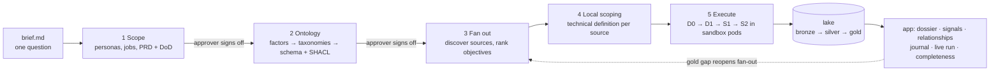

# Proveedor Abierto

**One open question in, evidence-backed supplier profiles out.** The input is a single sentence: *"Who receives
public money in Mexico through government contracts, and are they legitimate companies?"*. There is no dataset
and no list of sources. From that sentence, the [Ontofill](../ontofill) engine researches the problem, writes a
PRD with a testable definition of done, and derives an ontology that a person approves. It then finds the public
sources on its own and sends sandboxed computer-use agents on Vultr to fill every field. Each value keeps its
capture: the source link, a screenshot and the selector. This repo holds the case package the engine writes
(`case/`) and the investigation app that turns the result into dossiers, explained red flags, relationships and
a journal that traces any value back to the brief. Flags are signals to verify, never accusations.



| Folder | What goes there |
|--------|-----------------|
| `case/` | The case package: brief (the only human input), PRD, ontology, objectives, technical definition documents, macros. Written by the engine, forkable. |
| `app/` | Investigation app: dossier, signal explainer, relationships, case journal, watchlist and open export, completeness, approvals |
| `lake.example.yaml` | Pointer to the external lake (copy to `lake.yaml`; secrets only in env vars) |
| `docs/` | Definition docs and the demo script |

Code: Apache-2.0 (`LICENSE`). Case package: CC BY 4.0 (`case/LICENSE`). No data in git. Public sources only, no logins.

## The app

Investigation, not a dashboard. Every screen reads the engine's gold export and nothing else.

- **Supplier dossier** (`/suppliers/<id>`): every field with its value, confidence, status (gold, conflict,
  missing) and captures. Click a value's captures to see the source link, the screenshot and the selector the
  agent read.
- **Signal explainer** (`/signals`): each red flag with its rule, the evidence it was computed from, a
  plain-language explanation, steps to verify it, and a dispute path. Signals are prompts to check, not accusations.
- **Relationships** (`/relationships`): suppliers linked by a shared address, a shared legal representative or
  a procedure, each link backed by the value that creates it.
- **Case journal** (`/journal/<value_id>`): a replay from any value back to the brief, through the capture
  step, the technical definition, the objective, the ontology and the PRD.
- **Watchlist and open export** (`/watchlist`, `/export/*`): follow suppliers and see what changed since the
  previous run. Export gold as OCDS 1.1 JSON, CSV or RDF Turtle.
- **Completeness** (`/completeness`): the definition of done recomputed from gold and cross-checked against the
  engine's own `metrics.json`. It shows per-field bars against the 80% line and taxonomy coverage per level, and
  can follow a run live.
- **Approvals** (`/approvals`, approver role only): sign off the PRD, the factors and the ontology. Approving
  writes the `APPROVED` marker the engine waits for.

```bash
uv sync --all-extras
uv run pa-app serve --fixtures              # synthetic data, http://127.0.0.1:8400
uv run pa-app serve                         # real gold, via lake.yaml or PA_GOLD_DIR
uv run pa-app serve --role approver --port 8401
uv run pa-app dod                           # recompute the DoD from gold, cross-check metrics.json
uv run pytest -q                            # unit, HTTP, schema and headless-browser tests
```

Fixtures are synthetic and obviously fake: "Proveedor Ejemplo NN", RFC-shaped IDs starting with `ZZZ`, and
hosts on the reserved `.example` domain. They validate against the engine's contract JSON Schemas.

## Access: two roles, two gated URLs

The app runs as one process per role, and NetBird exposes each role on its own URL with its own access policy.
Neither VM opens an inbound port.

| Role | Process | Can | NetBird access policy |
|------|---------|-----|-----------------------|
| Investigator | `PA_ROLE=investigator` (default) | Read everything and export. Server side is read-only; the watchlist lives in the browser. | investigators group → investigator URL |
| Approver | `PA_ROLE=approver` | Everything above, plus phase sign-off in `/approvals`, which writes `case/<phase>/APPROVED` | SSO restricted to the approvers group → approver URL |

The role boundary is enforced in the app as well as at the gateway: the investigator process returns 403 for
approval routes, refuses cross-origin approval posts, and runs in a container with the case mounted read-only.
The proxy's `X-NetBird-User` header only prefills the approver's name; `APPROVED` records the name typed in.

### NetBird evidence

How it is deployed and gated: [`deploy/README.md`](deploy/README.md). Management is NetBird Cloud; the VMs
allow zero public inbound ports, SSH included. The two containers bind to loopback only;
`netbird expose` publishes one URL per role with its own credential (password or PIN for investigators, SSO
restricted to an approvers group for approvers). `deploy/verify.sh` proves the gate.

- [x] `deploy/verify.sh local` passes on a local rehearsal: loopback-only listeners, investigator 403 on approval
  routes, cross-origin approval refused, investigator container read-only. Binding to `0.0.0.0` makes it fail.
- [ ] `deploy/verify.sh remote` from outside the mesh: every probed VM port closed (SSH included), unauthenticated
  URLs refused *(pending VM)*
- [ ] Reverse-proxy services and their authentication settings (screenshot) *(pending VM)*
- [ ] Access groups: investigators vs approvers (screenshot) *(pending VM)*
- [ ] Peer list: control-plane and sandbox VMs connected peer to peer (screenshot, engine side) *(pending VM)*

## Built during the event

Built during the Vultr Agent Arena (Sat 11:30 → Sun 12:00 PT). The first commit (`e008b0d`) holds what
pre-existed: the definition documents in `docs/planning/` and `docs/reference/`, and an empty scaffold (folder
layout, placeholder READMEs, `case/brief.md`, `lake.example.yaml`). The full license texts were added in the same
commit. Everything else was built during the event, one granular commit at a time. The table is a snapshot of
`git log --reverse --format='%h %ad %s' --date=format:'%a %H:%M'`; the log itself is the source of truth.

| Commit | When (PT) | What |
|--------|-----------|------|
| `e008b0d` | Sat 13:32 | Scaffold: case package, app layout, definition docs, Apache-2.0 and CC BY 4.0 licenses |
| `80e6b3d` | Sat 13:39 | App foundation: gold-export reader, synthetic fixtures, DoD evaluator, supplier index and dossier |
| `0df86ab` | Sat 13:43 | Completeness view with live follow, lake file kind, bronze meta sidecars, headless UI smoke tests |
| `617b000` | Sat 13:43 | Sync definition docs |
| `0bdfe61` | Sat 13:52 | Investigation layer: signal explainer with dispute path, case journal, relationships, watchlist, exports, approvals |
| `5c59444` | Sat 13:54 | README with roles, NetBird evidence checklist and 'Built during the event'; demo script and video plan; local file lake support |
| `575acd9` | Sat 13:55 | Harden templates against missing confidence; render every page for every value; messy-row tests |
| `b7e8f09` | Sat 14:05 | Live run view (CONTRACT 4b/7/8) with replay for rehearsal and demo insurance |
| `4c2776b` | Sat 14:07 | Declare generated_by provenance in fixtures and replay status (engine schemas now require it) |
| `aa8fad5` | Sat 14:11 | Approver review screens for the PRD, factors (per-factor accept/reject) and ontology (CONTRACT v0.2 4c) |
| `5bce36b` | Sat 14:13 | Demo-replay mode: snapshot a run with its captures, replay it at N x or a set duration |
| `921b7ed` | Sat 14:13 | Demo script: stall fallback uses the snapshot replay |
| `7e3bef0` | Sat 14:18 | Deploy + NetBird gating for the app: two role containers on loopback, one credential per URL, verify.sh |
| `5812181` | Sat 14:20 | Evaluation harness (judges the engine, never feeds it): official reference taxonomies, Simula scorer, PRD rubric |
| `ca8c5c7` | Sat 14:24 | Operator run on the engine's first real (mock) output: adapt the app to structured trace fields |

Engine output written into `case/` during the live run is committed separately and marked by its
`generated_by` provenance. Mock runs never enter the tracked `case/`.

## Guardrails

- Profiles are of **legal entities**. Data about people is limited to what public records publish in their role
  (for example a legal representative), and is never enriched from social media.
- Flags are signals needing verification, with a documented way for a company to dispute them.
- Non-goals: accusing anyone, or scoring a "corruption probability".
