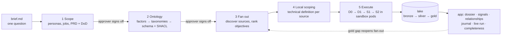
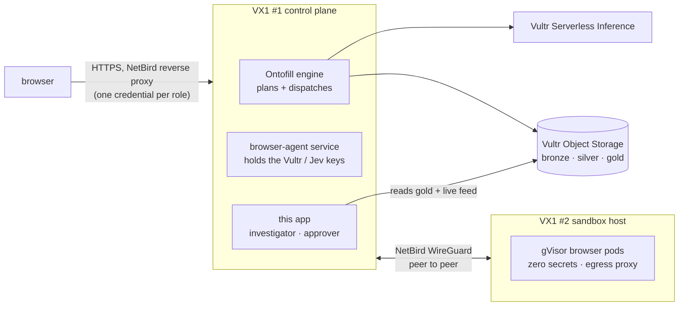

# Proveedor Abierto

**One open question in, evidence-backed supplier profiles out.** The input is a single sentence: *"Who receives
public money in Mexico through government contracts, and are they legitimate companies?"*. There is no dataset
and no list of sources. From that sentence, the [Ontofill](../ontofill) engine researches the problem, writes a
PRD with a testable definition of done, and derives an ontology that a person approves. It then finds the public
sources on its own and sends sandboxed computer-use agents on Vultr to fill every field. Each value keeps its
capture: the source link, a screenshot and the selector. This repo holds the case package the engine writes
(`case/`) and the investigation app that turns the result into dossiers, explained red flags, relationships and
a journal that traces any value back to the brief. Flags are signals to verify, never accusations.

This is the track's own **"Research with Receipts"** example: every claim in the app links to a screenshot of its
source.

## Use case

**Who uses it.** Investigative journalists, civil-society watchdogs and auditors who need to check a company that
won public contracts, quickly and with evidence they can cite.

**What they do in the app.**
1. Open a **dossier** for a company (`/entities/<id>`). Every property shows its value, confidence and status.
2. Click a value's **capture**: the source link, the screenshot of the page and the selector the agent read.
3. Read a **signal** (red flag): the rule, the evidence, a plain-language explanation, how to verify it, and the
   dispute path for the company.
4. **Trace any value back to the brief** (`/journal/<value_id>`): capture step, technical definition, objective,
   ontology, PRD, brief.

**What the agent does to get there** (five phases, two of them approved by a person):



## Architecture: "Two instances. One boundary."



- **Control plane (VX1 #1):** the engine plans each phase on Vultr models and dispatches jobs. The browser-agent
  service holds the Vultr and Jev keys. This app reads the gold export and the live run feed. *(Deployment pending.)*
- **Sandbox host (VX1 #2):** one gVisor pod per browser session, with an egress proxy limited to the source's
  allowed domains. Pods get **zero** secrets. *(Pending; the local rehearsal runs runc.)*
- **Lake:** bronze (raw captures), silver (observations) and gold (reconciled values) on Vultr Object Storage.
  Git never holds captured data.

**Two execution patterns, both visible in the app:**

| Pattern | Loop | Where you see it |
|---|---|---|
| B, browser use (primary) | browser action → a Vultr vision model verifies the screenshot against the step goal → retry if not achieved. A person approves anything final through the **approve-before-submit gate**. | `/run` step stream: verify verdicts per action; `/approvals`: action requests with screenshot and risk tier |
| A, code execution | extractor code attempt → run in the sandbox against stored captures → stderr fed back → patch → retry; a passing extractor is promoted to a macro | `/run` step stream: repair attempts with result, stderr excerpt and diff |

Every sandbox job reports **six proof checks** on `/run` → Sandbox proof: host check, task result, where it ran,
isolation probe (BLOCKED), teardown and secret hygiene (no keys in the pod; metadata IP and mesh BLOCKED). The
proof also shows each job's resource limits (memory, CPU, processes, timeout, steps) and any job a limit killed.

## Setup

**Local quickstart** (synthetic data, no credentials):

```bash
uv sync --all-extras
uv run pa-app serve --fixtures                        # http://127.0.0.1:8400, investigator role
uv run pa-app serve --fixtures --role approver --port 8401
uv run pa-app fixtures --domain libraries .cache/libs  # a second, unrelated domain (see below)
uv run pytest -q                                      # unit, HTTP, schema and headless-browser tests
```

**Against a real engine export:** copy `lake.example.yaml` to `lake.yaml` (S3 or `kind: file`), or point
`PA_GOLD_DIR` at a local export. `PA_RUN_ID` (or `serve --run-id`) pins a run that has no `latest` pointer, such
as a mock run. `PA_CASE_DIR` points at the case package.

**Deploy:** [`deploy/README.md`](deploy/README.md): Docker Compose with the two role containers, the NetBird Cloud
reverse proxy (one URL per role) and `deploy/verify.sh` to prove the gate.

**Public demo URL:** pending deployment.

**Generic over the ontology.** The app takes its domain from the case's approved ontology: the primary class,
property labels, definition-of-done properties, relations, rules and source classes
([`app/README.md`](app/README.md)). `pa-app fixtures --domain libraries` builds a public-libraries case that renders
every screen with no code changes.

| Folder | What goes there |
|--------|-----------------|
| `case/` | The case package: brief (the only human input), PRD, ontology, objectives, technical definition documents, macros. Written by the engine, forkable. |
| `app/` | Investigation app: dossier, signal explainer, relationships, case journal, watchlist and open export, completeness, approvals |
| `lake.example.yaml` | Pointer to the external lake (copy to `lake.yaml`; secrets only in env vars) |
| `docs/` | Definition docs and the demo script |

Code: Apache-2.0 (`LICENSE`). Case package: CC BY 4.0 (`case/LICENSE`). No data in git. Public sources only, no logins.

## The app

Investigation, not a dashboard. Every screen reads the engine's gold export and nothing else, and takes its
vocabulary from the case ontology.

- **Dossier** (`/entities/<id>`): every property with its value, confidence, status (gold, conflict,
  missing) and captures. Click a value's captures to see the source link, the screenshot and the selector the
  agent read.
- **Signal explainer** (`/signals`): each red flag with its rule, the evidence it was computed from, a
  plain-language explanation, steps to verify it, and a dispute path. Signals are prompts to check, not accusations.
- **Relationships** (`/relationships`): entities linked by the relations the ontology defines (here: shared
  address, shared legal representative, same procedure), each link backed by the value that creates it.
- **Case journal** (`/journal/<value_id>`): a replay from any value back to the brief, through the capture
  step, the technical definition, the objective, the ontology and the PRD.
- **Watchlist and open export** (`/watchlist`, `/export/*`): follow entities and see what changed since the
  previous run. Export gold as CSV or RDF Turtle, and as OCDS 1.1 JSON when the ontology aligns a class to OCDS.
- **Completeness** (`/completeness`): the definition of done recomputed from gold and cross-checked against the
  engine's own `metrics.json`, including each declarative DoD query. It shows per-property bars and taxonomy
  coverage per level, and can follow a run live.
- **Live run** (`/run`): phase timeline, step stream (modes, verify verdicts, repair attempts, escalations), live
  completeness, and the sandbox proof with six checks and resource limits.
- **Approvals** (`/approvals`, approver role only): sign off the PRD, the factors and the ontology, and approve or
  deny action requests from the approve-before-submit gate. Approving writes the `APPROVED` marker the engine waits
  for.

`uv run pa-app dod` recomputes the definition of done from gold and cross-checks `metrics.json`.

Fixtures are synthetic and obviously fake: "Proveedor Ejemplo NN", RFC-shaped IDs starting with `ZZZ`, and
hosts on the reserved `.example` domain. They validate against the engine's contract JSON Schemas.

## Access: two roles, two gated URLs

The app runs as one process per role, and NetBird exposes each role on its own URL with its own access policy.
Neither VM opens an inbound port.

| Role | Process | Can | NetBird access policy |
|------|---------|-----|-----------------------|
| Investigator | `PA_ROLE=investigator` (default) | Read everything and export. Server side is read-only; the watchlist lives in the browser. | investigators group → investigator URL |
| Approver | `PA_ROLE=approver` | Everything above, plus phase sign-off in `/approvals`, which writes `case/<phase>/APPROVED` | SSO restricted to the approvers group → approver URL |

The role boundary is enforced in the app as well as at the gateway: the investigator process returns 403 for
approval routes, refuses cross-origin approval posts, and runs in a container with the case mounted read-only.
The proxy's `X-NetBird-User` header only prefills the approver's name; `APPROVED` records the name typed in.

### NetBird: the Zero-Port Access bonus

How it is deployed and gated: [`deploy/README.md`](deploy/README.md). Management is NetBird Cloud.

| Bonus criterion (NetBird deck) | Our setup | Evidence |
|---|---|---|
| 1. No open ports | The app containers bind to loopback. The public URLs go through the NetBird reverse proxy. The VMs allow zero public inbound ports, SSH included (admin over NetBird). | `deploy/verify.sh local` ✓ (laptop rehearsal) · `deploy/verify.sh remote` *(pending VM)* |
| 2. Gated access tied to a role | Two URLs, two credentials: investigator = password or PIN; approver = SSO restricted to the approvers group. The app enforces the same boundary (investigator process: 403 on approval routes, read-only container). | `verify.sh local` ✓ · proxy auth settings screenshot *(pending VM)* |
| 3. Peer-to-peer | The control-plane VM and the sandbox VM talk over WireGuard; the sandbox host sits in its own group, which can reach only the control plane's ports (the deck's "fence in your agents"). | peers list + access policy screenshot *(pending VM; engine side)* |
| 4. Lifecycle-bound URLs (clarification) | Each agent pod's live view is exposed with `netbird expose --with-pin` for exactly the pod's lifetime; the run view links it from `status.json.live_view_url`. | run view "Watch the agent's browser" link *(pending engine)* |

Before any screenshot: every peer, group and service name on screen is neutral (no employer or client names),
and no emails, keys or PIN fields are in frame.

## Built during the event

Built during the Vultr Agent Arena (Sat 11:30 → Sun 12:00 PT). The first commit (`e008b0d`) holds what
pre-existed: the definition documents in `docs/planning/` and `docs/reference/`, and an empty scaffold (folder
layout, placeholder READMEs, `case/brief.md`, `lake.example.yaml`). The full license texts were added in the same
commit. Everything else was built during the event, one granular commit at a time. The table is a snapshot of
`git log --reverse --format='%h %ad %s' --date=format:'%a %H:%M'`; the log itself is the source of truth:
[public commit history](https://github.com/ricalanis/proveedor-abierto/commits/main).

| Commit | When (PT) | What |
|--------|-----------|------|
| `e008b0d` | Sat 13:32 | Scaffold: case package, app layout, definition docs, Apache-2.0 and CC BY 4.0 licenses |
| `80e6b3d` | Sat 13:39 | App foundation: gold-export reader, synthetic fixtures, DoD evaluator, supplier index and dossier |
| `0df86ab` | Sat 13:43 | Completeness view with live follow, lake file kind, bronze meta sidecars, headless UI smoke tests |
| `617b000` | Sat 13:43 | Sync definition docs |
| `0bdfe61` | Sat 13:52 | Investigation layer: signal explainer with dispute path, case journal, relationships, watchlist, exports, approvals |
| `5c59444` | Sat 13:54 | README with roles, NetBird evidence checklist and 'Built during the event'; demo script and video plan; local file lake support |
| `575acd9` | Sat 13:55 | Harden templates against missing confidence; render every page for every value; messy-row tests |
| `b7e8f09` | Sat 14:05 | Live run view (CONTRACT 4b/7/8) with replay for rehearsal and demo insurance |
| `4c2776b` | Sat 14:07 | Declare generated_by provenance in fixtures and replay status (engine schemas now require it) |
| `aa8fad5` | Sat 14:11 | Approver review screens for the PRD, factors (per-factor accept/reject) and ontology (CONTRACT v0.2 4c) |
| `5bce36b` | Sat 14:13 | Demo-replay mode: snapshot a run with its captures, replay it at N x or a set duration |
| `921b7ed` | Sat 14:13 | Demo script: stall fallback uses the snapshot replay |
| `7e3bef0` | Sat 14:18 | Deploy + NetBird gating for the app: two role containers on loopback, one credential per URL, verify.sh |
| `5812181` | Sat 14:20 | Evaluation harness (judges the engine, never feeds it): official reference taxonomies, Simula scorer, PRD rubric |
| `ca8c5c7` | Sat 14:24 | Operator run on the engine's first real (mock) output: adapt the app to structured trace fields |
| `ec4e897` | Sat 14:25 | Judge-facing evidence: README pitch + five-phase diagram + commit-backed build list; timed rehearsal and Q&A crib |
| `5a35c3c` | Sat 14:26 | Fixture sandbox jobs follow the engine's jobs.schema.json; replay emits complete job records only |
| `0671472` | Sat 14:27 | CONTRACT v0.5: label preview-past-checkpoint output; show evidence format apart from source class |
| `9d83502` | Sat 14:30 | Engine report card (/engine): score the engine's own output against the eval yardstick |
| `1421a06` | Sat 14:31 | Deploy docs for NetBird Cloud; verify.sh remote requires SSH closed too; screenshot name hygiene |
| `de020d1` | Sat 14:38 | Sync definition docs |
| `eda254a` | Sat 14:39 | CONTRACT v0.6: Jev as a supporting decision backend |
| `0649b67` | Sat 14:40 | Add event decks reference (synced) |
| `cbd8d51` | Sat 14:41 | Align with the event decks: isolation tier + verifiable outputs in the proof, deck language in demo docs, NetBird bonus mapping |
| `ebe6df1` | Sat 14:42 | deploy: no secrets in cloud-init user_data (readable via the metadata service) |
| `68cc710` | Sat 14:45 | Show how each source was found (discovered_by) in the run view, the journal index and the journal replay |
| `9deef5c` | Sat 14:49 | deploy/netbird_services.py: the two role URLs as NetBird Cloud reverse-proxy services, via the API |
| `e303624` | Sat 14:56 | Approver-only /spend page from the spend tracker's history; deploy binds to the NetBird IP (confirmed) |
| `2dc71df` | Sat 15:19 | Generic, ontology-driven app (CONTRACT v0.7 §11): entities + the case's ontology, second-domain proof |
| `87eb1e2` | Sat 15:19 | Sync reference docs |

Engine output written into `case/` during the live run is committed separately and marked by its
`generated_by` provenance. Mock runs never enter the tracked `case/`.

## Guardrails

- Profiles are of **legal entities**. Data about people is limited to what public records publish in their role
  (for example a legal representative), and is never enriched from social media.
- Flags are signals needing verification, with a documented way for the entity to dispute them.
- Non-goals: accusing anyone, or scoring a "corruption probability".
