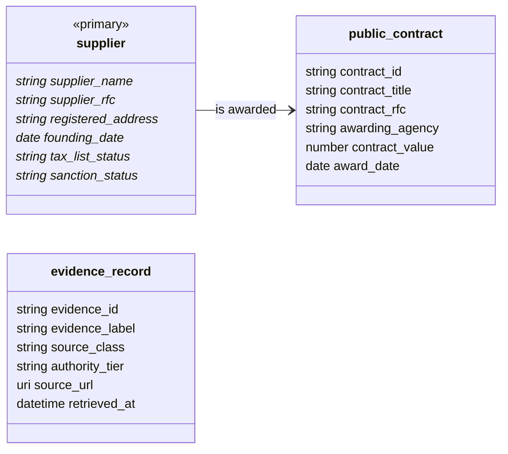
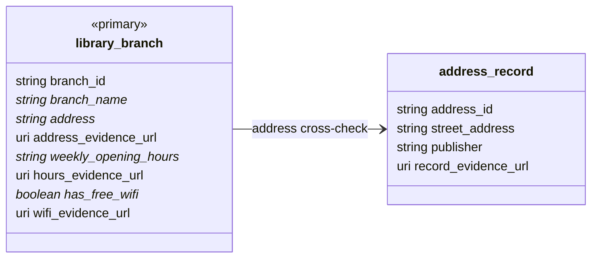

# Engine output: the ontologies Ontofill wrote

Two case packages, copied **verbatim** from the control VM on Sun 27 Sep 2026 at 18:45 UTC. Ontofill wrote every file
here from a one-sentence `brief.md`: the PRD with its definition of done, the factors, the ontology, the SHACL shapes,
the compiled DoD queries, the source reviews and the discovery record. People only approved or denied, with reasons;
each approval is bound to the sha256 of the exact file reviewed (`APPROVED`, `revisions/`, `decisions.jsonl`). Nothing
was edited. Captures and gold stay in the lake on Vultr Object Storage; these folders only point to them.

The diagrams below are generated from each `02-ontology/ontology.json` by
[`eval/ontology_diagram.py`](../../eval/ontology_diagram.py). The live views are on the read-only judges console.

| Case | Question | Ontology file | Live views |
|------|----------|---------------|------------|
| Proveedor Abierto | Who receives public money in Mexico through government contracts, and are they legitimate companies? | [`ontology.json`](proveedor-abierto/02-ontology/ontology.json) (`e1f335c559d2`) | [ontology](https://ontofill-console-judges.eu1.netbird.services/cases/proveedor-abierto/approvals/02-ontology) · [definition of done](https://ontofill-console-judges.eu1.netbird.services/cases/proveedor-abierto/definition) · [runs](https://ontofill-console-judges.eu1.netbird.services/cases/proveedor-abierto/runs) |
| SF library branches | Which San Francisco Public Library branches offer free Wi-Fi, and when is each one open? | [`ontology.json`](sf-library-branches/02-ontology/ontology.json) (`1a7e07df2e1d`) | [ontology](https://ontofill-console-judges.eu1.netbird.services/cases/sf-library-branches/approvals/02-ontology) · [answer](https://ontofill-console-judges.eu1.netbird.services/cases/sf-library-branches/answer) |

## Where each case stands (18:45 UTC)

- **Proveedor Abierto.** PRD, factors and ontology approved. Phase 3 found and reviewed sources and now renders the
  federal procurement portal inside the sandbox. It stopped at 18:42 UTC asking for a person: the portal's contract
  files (`ExpedientesPublicados2015.csv` to `2022.csv`) are listed by a public GET API, but each download is a POST
  that carries an anti-bot token. Under the read-only rules the engine stops and flags that instead of working around
  it. The next route is a public OCDS publication fetched by GET. No engine gold yet.
- **SF library branches.** PRD, factors and ontology approved; the run is discovering sources. The approved ontology
  binds every core field, including weekly opening hours. Its compiled definition of done is not yet meetable: dod4
  and dod5 compile to counts that only an empty output passes. That defect is filed, and because captures are kept,
  the fix re-measures gold from bronze without browsing again.

### Proveedor Abierto

Primary class `supplier` · 3 classes · 18 properties · 1 relations · 1 rules · generated by `qwen3.8-flash-next` (vultr). `*` marks a definition-of-done property.

| Criterion (approved PRD) | Target | Compiled query |
|---|---|---|
| dod1: Suppliers linked to real public contracts from Mexican official procurement sources | >= 50 | `count_entities_with_relation` on `supplier`, via `supplier_awarded_contract` |
| dod2: Ratio of linked suppliers with a complete core profile (identity, address, founding date, tax-list status, sanction status) | >= 0.8 (min_ratio 0.8) | `entities_meeting_completeness` on `supplier` |
| dod3: Recorded values without evidence | <= 0 | `count_values_without_evidence` |
| dod4: Distinct source classes used | >= 4 | `count_distinct_source_classes` |

### SF library branches

Primary class `library_branch` · 2 classes · 12 properties · 1 relations · 0 rules · generated by `qwen3.8-flash-next` (vultr). `*` marks a definition-of-done property.

| Criterion (approved PRD) | Target | Compiled query |
|---|---|---|
| dod1: Share of SFPL branches listed with address, weekly opening hours, and free Wi-Fi yes/no | >= 1 (min_ratio 1) | `entities_meeting_completeness` on `library_branch`, via `address_cross_check` |
| dod2: Share of listed values (address, hours, Wi-Fi) with a cited source | >= 1 (min_ratio 1) | `entities_meeting_completeness` on `library_branch`, via `address_cross_check` |
| dod3: Share of branch addresses cross-checked against data.sfgov.org | >= 1 (min_ratio 1) | `entities_meeting_completeness` on `library_branch`, via `address_cross_check` |
| dod4: Share of values sourced from non-public or non-read-only sources | <= 0 | `count_distinct_source_classes` |
| dod5: Number of branches listed that are missing from the final output | <= 0 | `count_entities` on `library_branch` |

